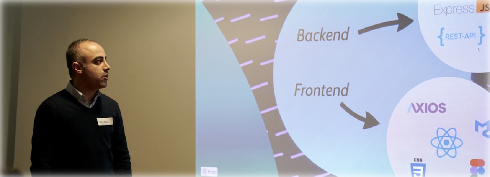

 

# Hi there, I'm Morteza 👋 

- ➡️ I’m currently a Full-stack developer at 
- 🌱 I’m currently learning everything 🤣
- 👀 I’m interested in coding 
- 👯 I’m looking to collaborative opportunities
- ❤️ I love to travel ✈️

### Connect with me:

&nbsp;&nbsp;

&nbsp;&nbsp;

 
 

### Languages and Tools:

[][webdevplaylist]
[][webdevplaylist]
[][cssplaylist]
[][jsplaylist]
[][reactplaylist]
[][webdevplaylist]
[][webdevplaylist]
[][webdevplaylist]
[][webdevplaylist]

 
 

----

[website]: https://
[course]: http://codeyourfuture.io
[twitter]: https://twitter.com/
[youtube]: https://youtube.com/
[instagram]: https://instagram.com/
[linkedin]: https://www.linkedin.com/in/morteza-khojasteh
[webdevplaylist]: https://www.youtube.com/
[jsplaylist]: https://www.youtube.com/
[cssplaylist]: https://www.youtube.com/
[reactplaylist]: https://www.youtube.com/

